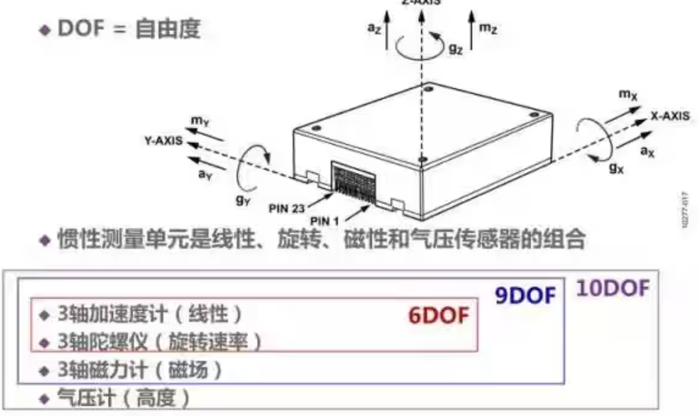

# IMU学习笔记

## IMU是什么
1. IMU 全称位inertial measurement unit,中文为惯性测量单元。在无需外部参考的情况下，便可测量载体的加速度和角速度，9轴设备可以测量载体的姿态角，10轴设备可以测量载体的气压。

IMU通常由一个加速度计和一个陀螺仪组成，加速度计能够获取3轴XYZ的加速度，陀螺仪可以获取围绕该坐标系的3轴角速度，即形成了6轴，也称作6DOF测量量。9轴IMU中，IMU添加了磁力计，可以获取到东北天或北动地坐标系下的三轴朝向，获得了姿态信息。此外10轴，IMU在9轴的基础上添加气压传感器获取到气压值。

2. 加速度计
加速度计通过牛顿第二定律 $a=\frac{F}{m}$,测量物体惯性力。加速度计固定在运动系统上，因此它测量的是机体坐标系下沿自身三个轴方向的线加速度分量，而不是惯性坐标系下的加速度。由于加速度计本身不能单独确定系统姿态，所以若要得到惯性坐标系中的加速度，需要结合姿态估计结果将测量值从机体坐标系旋转到惯性坐标系。单位类型，分别是$m/s^2$或是基于当地单位重力加速度g的\[0,1](0到1)倍的系数。

4. 陀螺仪
陀螺仪在惯性参照系中用于测量系统的角速率。通过系统初始方位作为初始条件，对角速率进行积分，就可以时刻得到系统的当前方向。测量单位分为rad/s或deg/s。

5. 磁力计
当加速度传感器完全水平的时候，重力传感器无法分辨出在水平面旋转的角度，即绕Z轴的旋转无法显示出来，此时只有陀螺仪可以检测。陀螺仪虽然测量十分快，但由于其工作原理是积分，所以在静态会有累计误差，表现为角度会一直增加或者一直减少。于是我们会需要一个在水平位置能确认朝向的传感器，这就是如今IMU必备的第三个传感器，磁力计，通过这3个传感器的相互校正，我们终于得到了比较准确的姿态参数。磁力计的测量结果一般是位姿四元数(x,y,z,w)

6. 气压传感器
气压传感器是用于检测大气压强的仪器,实际应用当中气压传感器可作高度计。在惯导系统中有时通过增加气压计增强Z轴动态与精度。